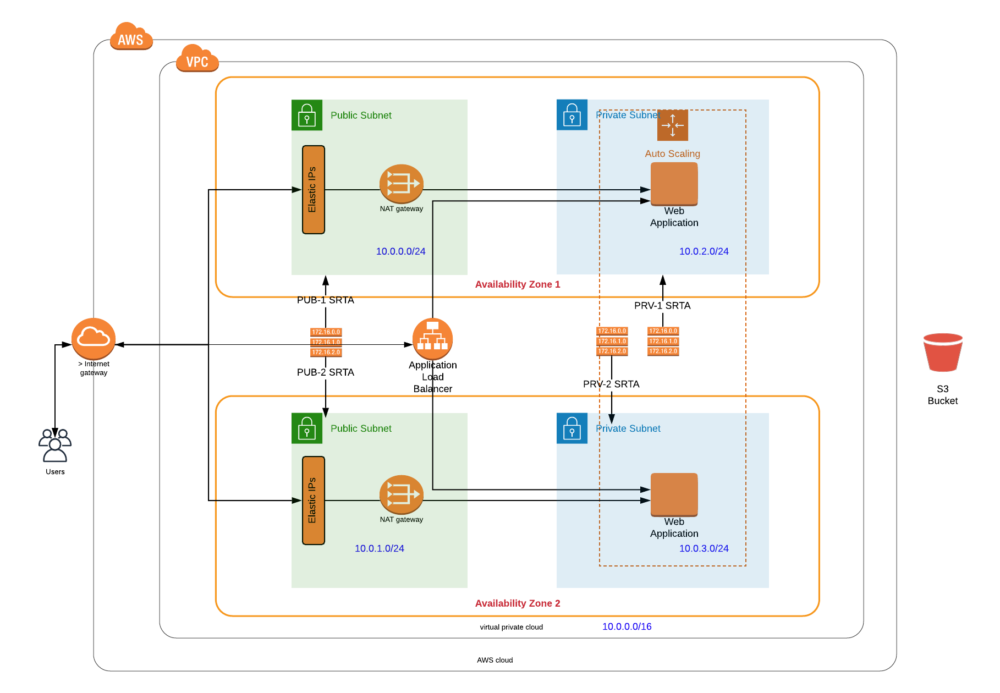

# aws-cloud-devops
cloud devops scripts using aws web services.

### Architecture Diagram




The diagram above illustrates the architecture implemented by the CloudFormation code stored within the folder 'infrastructure'.

The architecture comprises of 4 different layers. Each layer is represented by its own CloudFormation stack.

The 4 implementation layers are as follows:

- Layer-1: Subnets (Resources: Public and Private subnets, VPC)
- Layer-2: Internet (Resources: Internet Gateway and NAT Gateways)
- Layer-3: Security (Resources: Public and Private RouteTables)
- Layer-4: Servers (Resources: Load-Balancers, Server Launch Configurations).

Jumpbox CloudFormation stack / code is also provided.

Please note that bash scrips are provided to assist in the creation of CloudFormation stacks.

To create the environment, the following commands can be used (in the exact order):

```bash
./script-create-stack.sh stack-subnet stack-subnet.yml param-subnet.json
./script-create-stack.sh stack-internet stack-internet.yml param-internet.json
./script-create-stack.sh stack-security stack-security.yml param-security.json
./script-create-instances.sh stack-server stack-server.yml param-server.json
```

Similarly, if needed, a jumpbox stack can be created:
```bash
./script-create-stack.sh stack-jumpbox stack-jumpbox.yml param-jumpbox.json
```

A number of utility bash scripts are also provided:
- script-list-outputs.sh  >> to list all outputs
- script-list-stack-status.sh  >> user friendly display of status of all running stacks
- script-delete-stack.sh >> to delete existing stack
- script-validate.sh  >> to validate a YAML template for any syntax or formatting error
